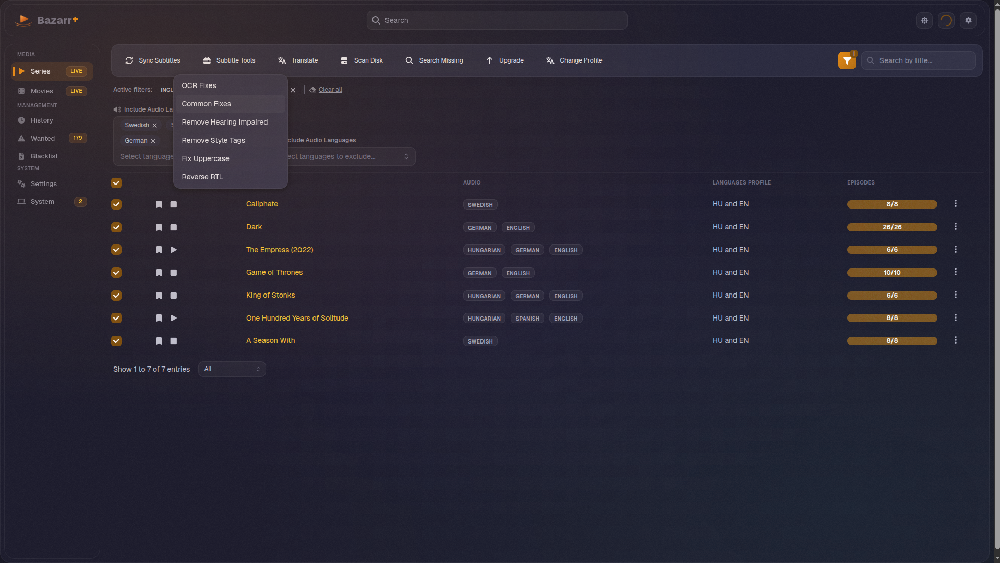
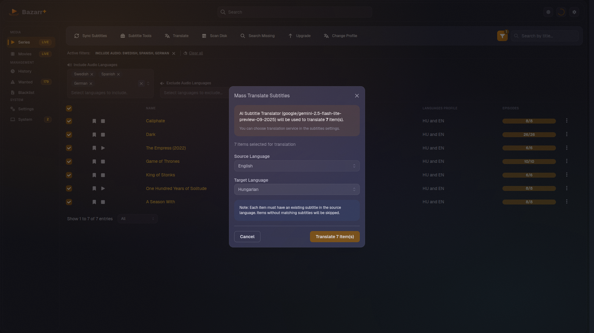
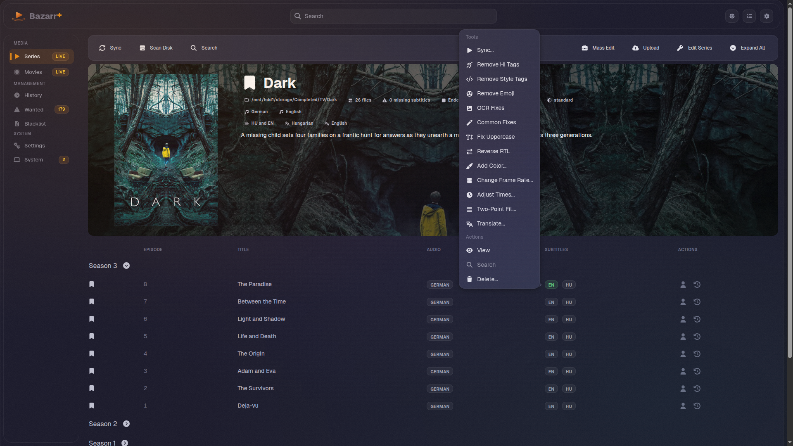
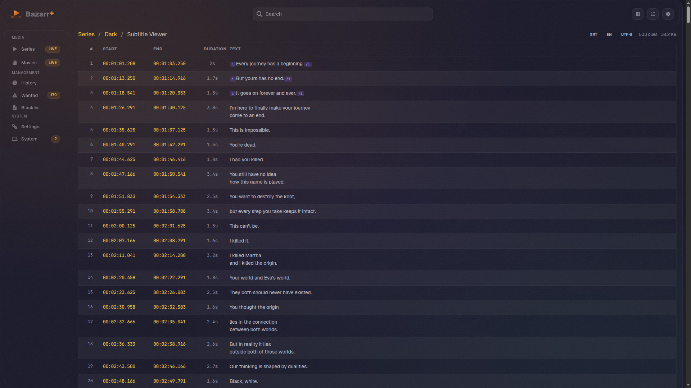
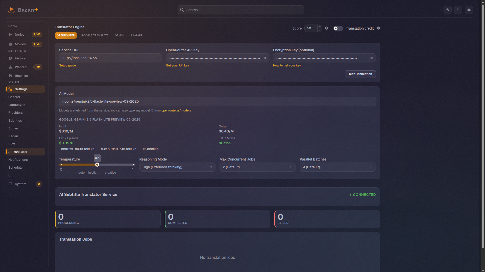
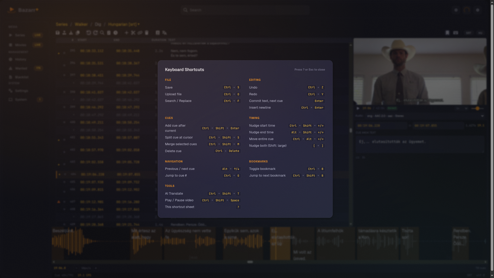

<p align="center">
  
</p>

# <p align="center">Bazarr+


  <a href="https://ghcr.io/lavx/bazarr"></a>
  <a href="https://github.com/LavX/bazarr/releases/latest"></a>
  <a href="https://github.com/LavX/bazarr/actions/workflows/build-docker.yml"></a>
  <a href="https://discord.gg/WSVzzaDg"></a>
</p>

<p align="center">
  <strong>Enhanced subtitle management built on <a href="https://www.bazarr.media">Bazarr</a></strong>
</p>

<p align="center">
  <strong>Provider Hub</strong> plugin catalog · <strong>Distribution Hub</strong> multi-tenant subtitle API · <strong>Combined bilingual/trilingual subtitles</strong> · AI translation via OpenRouter (300+ LLMs) · translate from embedded tracks · multi-engine subtitle sync · Subtitle Editor with video preview and waveform · No tracking · Provider priority · OpenSubtitles.org native plugin · API key encryption at rest · Jellyfin library refresh · bulk operations · security hardening · Python 3.14 · navy + amber dark theme
</p>

<p align="center">
  <a href="https://lavx.github.io/bazarr/guides/"><strong>Guides</strong></a> ·
  <a href="https://github.com/LavX/bazarr"><strong>GitHub</strong></a> ·
  <a href="https://github.com/LavX/bazarr/releases/latest"><strong>Releases</strong></a>
</p>

---

## What is Bazarr+?

Bazarr+ is a hard fork of [Bazarr](https://github.com/morpheus65535/bazarr) by morpheus65535. It keeps the subtitle management workflow you already know (Sonarr/Radarr integration, language profiles, scheduled searches, scoring) and builds on top of it: an installable provider plugin system, a multi-tenant subtitle API you can hand to other apps, AI translation, combined subtitle output, and a hardened, no-telemetry runtime.

It is a drop-in container replacement for upstream Bazarr. Point it at your existing `/config`, start it, and your media, profiles, and providers carry over. See [Switching from upstream Bazarr?](#switching-from-upstream-bazarr) before you migrate.

Bazarr+ uses its own versioning starting at v2.0.0, unrelated to upstream version numbers.

---

## Switching from upstream Bazarr?

- Migration can be as simple as replacing the container image with `ghcr.io/lavx/bazarr:latest` and starting the container
- Back up your `/config` directory first
- Bazarr+ uses independent versioning starting at v2.0.0, unrelated to upstream version numbers
- Config changes made by Bazarr+ are not backwards-compatible with upstream Bazarr, so switching back requires restoring your backup
- Schema migrations run automatically on first boot; existing settings, profiles, providers, and any shared API token carry over
- Provider Hub is additive. Existing providers keep working, and installed plugin providers can be enabled under Settings > Providers after restart
- The OpenSubtitles-compatible endpoint is now managed from the Distribution Hub. If you used the old Settings > External Integration page, your shared token is preserved as a Distribution Hub key and that route now redirects to the Distribution Hub
- Recommended: test with a copy of your config before committing to the switch
- See the [migration guide](https://lavx.github.io/bazarr/guides/) for the full walkthrough

---

## At a Glance

| Feature | Upstream Bazarr | Bazarr+ |
|---------|-----------------|---------|
| **Provider Hub (catalog plugins)** | Not available | Marketplace for installable subtitle provider plugins. Catalog sources, trust labels, staged activation, worker validation, isolated environments, activity log. Catalog plugins can replace shipped built-ins, and enabled built-ins can opt in to auto-install from the official catalog on startup (off by default). Local `.zip` package installs supported. |
| **Distribution Hub (multi-tenant subtitle API)** | Not available | Multi-tenant control plane for the OpenSubtitles-compatible API. Named API keys, editable tiers, per-window metering and rate limits, per-key provider scoping. Two first-party clients: [Jellyfin plugin](https://github.com/LavX/jellyfin-plugin-bazarr-plus) and [VLSub Bazarr+](https://github.com/LavX/vlsub-bazarr-plus). |
| **Combined subtitles (bilingual / trilingual)** | Not available | Composes existing on-disk subtitles into a single bilingual or trilingual SRT or ASS file, per language profile or on demand. Pure composition, never triggers translation. |
| **Translate from embedded tracks** | Not available | Embedded (in-container) text tracks score at 100% source quality and can be translated directly. Bitmap tracks (PGS/VobSub) are rejected with a clear error. |
| **Multi-engine subtitle sync** | Single engine | Multiple sync engines with a side-by-side output comparison before you keep a result. |
| **Jellyfin Library Refresh** | On upstream's `development` branch only (no released version) | Cherry-picked and polished: HTTPS with optional self-signed cert acceptance, per-library overrides, secret redaction, response cap, "Refresh now" Maintenance card |
| **Provider Priority** | [Rejected](https://bazarr.featureupvote.com/suggestions/112323/provider-prioritization) (62 votes) | Dual mode: priority order with early stop, or classic simultaneous |
| **OpenSubtitles.org (native plugin)** | Not available | Provider Hub plugin that scrapes in-process via ai-cloudscraper with inline Anubis proof-of-work solving; FlareSolverr recommended for Cloudflare challenges |
| **AI Subtitle Translator (OpenRouter)** | Not available | 300+ LLMs + any custom model ID |
| **API Key Encryption** | Not available | AES-encrypted **at rest** (provider keys, Sonarr/Radarr, Plex token, OpenRouter key, Distribution Hub token) with auto-migration and key rotation; AES-256-GCM **in transit** to the AI translator |
| **Translate from Missing Menu** | Not available | Action menu on missing subs with source language picker |
| **Batch Translation** | Not available | Translate entire series/libraries from Wanted pages |
| **Mass Subtitle Sync** | [Rejected](https://bazarr.featureupvote.com/suggestions/172013/mass-sync-all-subtitles) (249 votes) | Bulk sync from Tasks page or Mass Edit, skips already-synced |
| **Bulk Operations** | One-at-a-time only | 11 batch actions: sync, translate, OCR fixes, common fixes, remove HI, remove tags, fix uppercase, reverse RTL, scan disk, search missing, upgrade (up to 10k items) |
| **Dedicated Translator Settings** | Not available | 4-zone page with pricing, cost estimates, status panel |
| **No Tracking** | GA4 + legacy UA phone home to Google | All telemetry removed, nothing phones home |
| **Security Hardening** | MD5, no CSRF/SSRF/rate limiting | PBKDF2 (600k iter), CSRF, SSRF, brute-force, 4 more |
| **Subtitle Editor** | Not available | Full editor with video preview, waveform timeline, AI translation, ffsubsync, 8 format support, 40+ shortcuts |
| **Subtitle Viewer** | Not available | Read-only subtitle preview with SRT/VTT/ASS parsing, cue table, and format detection |
| **Audio Language Display** | Not shown in tables | Badges in all table views |
| **Advanced Table Filters** | No filters | Include/exclude audio, missing subtitle, title search |
| **Floating Save + Ctrl+S** | Not available | Sticky save button with 3-option unsaved changes modal |
| **Navy + Amber Theme** | Purple | `#121125` navy to `#fff8e1` cream, amber accents |
| OpenSubtitles.com (API) | Available | Available |
| Docker images | linuxserver.io / hotio | ghcr.io/lavx (self-built, multi-arch) |
| Python runtime | 3.8-3.13 | 3.14 |

---

## Quick Start

### Option 1: Docker Compose (Recommended)

```bash
# Clone with submodules
git clone --recursive https://github.com/LavX/bazarr.git
cd bazarr

# Configure your media paths in docker-compose.yml, then:
docker compose up -d

# Access Bazarr at http://localhost:6767
```

### Option 2: Pull Pre-built Images

```bash
# Pull all images
docker pull ghcr.io/lavx/bazarr:latest
docker pull ghcr.io/lavx/ai-subtitle-translator:latest
```

### Option 3: Run without Docker

Requires Python 3.14 and Node.js 18+ (for building the frontend).

```bash
# Clone with submodules
git clone --recursive https://github.com/LavX/bazarr.git
cd bazarr

# Install Python dependencies
pip install -r requirements.txt

# Build the frontend
cd frontend && npm ci && npm run build && cd ..

# Run
python3 docker/supervisor.py --config ./data --port 6767
```

**System dependencies** (install via your package manager):
- `ffmpeg` (subtitle sync, video analysis)
- `mediainfo` (media file metadata)
- `unrar` (compressed subtitle extraction)

**Notes:**
- The `--config` flag sets where the database, logs, and settings are stored
- The supervisor runs a lightweight aiohttp server on the same port, serving the frontend instantly and proxying API requests to the backend. You get a startup screen with progress stages while the backend initializes, and automatic restart on crashes.
- Media paths are configured in the web UI under Settings > Sonarr/Radarr

---

### Screenshots

| Series with batch actions | Mass translate dialog |
|:---:|:---:|
|  |  |

| Series detail with fanart | Subtitle viewer |
|:---:|:---:|
|  |  |

| AI Translator settings |
|:---:|
|  |

---

<details>
<summary><strong>Feature Details</strong></summary>

### Provider Hub
Bazarr+ turns subtitle providers into installable plugins. Provider Hub lives under Settings > Providers and adds Marketplace, Updates, Sources, My Providers, and Activity views to the provider settings area.

Provider Hub supports the official [LavX/bazarr-provider-catalog](https://github.com/LavX/bazarr-provider-catalog) source plus additional GitHub catalog sources for community providers. The catalog repository includes SDK tooling for provider authors.

- **Marketplace install flow**: browse provider cards, filter by source, see trust labels, install providers, test connections, uninstall plugins, and discover updates
- **Built-in replacement**: a trusted catalog entry can reuse a built-in provider id and replace the shipped version, collapsing the built-in and its catalog mirror into a single provider card. Untrusted catalogs can never shadow a built-in
- **Startup auto-install** (opt-in, off by default): when enabled, Bazarr+ installs the official-catalog version of your enabled built-ins on startup, with an "Installing providers" stage shown during boot. Manual Marketplace installs always work
- **Local package installs**: upload a provider `.zip` from the Marketplace. It is extracted (zip-slip and zip-bomb guarded), manifest-validated, hash-verified, built into a venv, and smoke-tested. Local installs are always untrusted, never shadow a built-in, and are never overwritten by a catalog update
- **Staged lifecycle**: installs, updates, and active removals are staged first, then promoted or removed during restart
- **Safety boundary**: bundles are hash-checked, dependencies are exact and hash-pinned, provider files are fetched from pinned GitHub commits, and imports are worker-validated before activation
- **Isolated dependencies**: plugin dependencies install into provider-specific virtual environments instead of the app-wide runtime
- **Activity log**: catalog refreshes, installs, updates, tests, removals, durations, target identities, version changes, and errors are visible to operators
- **Provider author SDK**: `python3 -B -m sdk validate`, `python3 -B -m sdk hash providers/<id>`, `python3 -B -m sdk build-catalog`, and `python3 -B -m sdk smoke-test` help authors validate manifests, bundle hashes, catalog output, and smoke behavior

### Distribution Hub
Bazarr+ exposes an OpenSubtitles-compatible REST API (`/api/v1`) so external clients can query your Bazarr+ instance as a federated subtitle service. The Distribution Hub is the top-level menu where you manage that API as a multi-tenant control plane. Two first-party clients pair with it: a [Jellyfin 10.11+ subtitle plugin](https://github.com/LavX/jellyfin-plugin-bazarr-plus) and a [VLC 3.0+ Lua extension (VLSub Bazarr+)](https://github.com/LavX/vlsub-bazarr-plus).

- **Named API keys**: issue per-client keys from the API Keys tab. The token is shown once at creation, then only the hash is stored. Rotate, disable, or delete keys at any time
- **Tiers and metering**: assign editable preset tiers (0 means unlimited for that window) or set custom hourly, daily, weekly, and monthly limits per key. Usage is metered per window; over-limit search returns 429 and download returns 406. Metering is best-effort and never fails a subtitle request with a 500
- **Per-key provider scoping**: each key carries an allowed and excluded provider list, so different clients reach different subsets of your providers. A reserved `local` name controls access to on-disk subtitles. A per-request `only_providers` allow-list can narrow a key's grant but never widen it
- **Provider fanout**: search runs your enabled providers in parallel via a dedicated bounded thread pool with dogpile coalescing
- **JWT auth**: short-lived bearer tokens bound to their issuing key, with sliding-window rate limiting and immediate revocation on logout
- **Signed stream tokens**: downloads return one-shot HMAC-signed stream URLs with a TTL; raw provider URLs are never exposed
- **SSRF guard with DNS rebinding protection**: every outbound URL the API touches blocks loopback, RFC1918, link-local, and any IP that fails revalidation post-DNS resolution
- **TVDB v4 + OMDB enrichment**: given an IMDB id, the layer hydrates season/episode and TVDB series id so providers that key on TVDB just work; the OMDB refiner (broken since the Python 3 migration upstream) is revived
- **Usage UI**: Overview cards and a 30-day usage chart, a per-key usage tooltip, and an idempotent legacy seed that preserves your existing shared token as an unlimited default key so older clients keep working

The Distribution Hub replaces the old Settings > External Integration page. `/settings/external` now redirects to `/distribution-hub`, and your previous shared token is recoverable from the default key's "Reveal token" action.

### Jellyfin Library Refresh
The base Jellyfin integration was cherry-picked from upstream's `development` branch (which has not shipped in any released upstream version). Bazarr+ adds the polish: an explicit `verify_ssl` toggle so HTTPS Jellyfin instances with self-signed certs work, humanised empty/loading/error states in the LibrarySelector, a "Refresh now" Maintenance card to verify connectivity without doing a real download, Atmospheric Dark conventions on the Settings page, and a hardening pass: API keys kept out of URL strings (header only), secret redaction in logs, response cap to prevent runaway downloads, ID validation on incoming `ProviderIds`, and streamed responses closed on read failure.

This pairs with the Distribution Hub to make the Bazarr+ and Jellyfin loop symmetric: library refresh is Bazarr+ to Jellyfin (push); the Distribution Hub API is Jellyfin to Bazarr+ (pull).

### API Key Encryption at Rest
Every sensitive credential Bazarr+ stores on disk is AES-encrypted under a per-instance master key. Protected fields include all provider API keys, Sonarr/Radarr keys, the Plex token (unified under the shared master key), the OpenRouter key for the AI translator, and the Distribution Hub admin token. The settings API masks `SYSTEM_SECRETS` in `/api/system/settings` responses so the frontend never sees raw secrets, only a sentinel. The auth password hash is never returned to the UI.

A central `secret_store` module owns crypto: every sensitive field is registered up front (no field is encrypted by accident, no field is left in cleartext by accident). On first boot after upgrade, Bazarr+ auto-migrates existing cleartext values into the encrypted store. Key rotation is supported with end-to-end tests covering rotation, masking, migration, decrypt-on-read, encrypt-on-write, force-migrate, and the supervisor's index.html injection path.

Encryption covers both the disk surface (the credentials above, at rest) and keys in transit between Bazarr+ and the AI translator (AES-256-GCM).

### OpenSubtitles.org (Native Provider Hub Plugin)
OpenSubtitles.org shut down their XML-RPC API for all third-party apps, VIP included. In v2.4, OpenSubtitles.org is a native Provider Hub plugin. Install "OpenSubtitles.org" from the Provider Hub Marketplace and it scrapes the site in-process using `ai-cloudscraper`, solving the Anubis proof-of-work challenge inline. There is no separate microservice or sidecar container anymore. No API key or VIP subscription needed.

FlareSolverr is strongly recommended. Run a FlareSolverr container and set its `/v1` endpoint in the plugin's **FlareSolverr URL** setting. FlareSolverr is used as a fallback to solve Cloudflare browser challenges when `ai-cloudscraper` is itself challenged. The plugin exposes `flaresolverr_url` and `flaresolverr_timeout_ms` settings.

### Provider Priority
Upstream Bazarr queries all subtitle providers simultaneously and picks the highest-scored result. There's no way to prefer one provider over another. This has been [requested for 6 years](https://bazarr.featureupvote.com/suggestions/112323/provider-prioritization) (62 votes), but upstream rejected it as "won't happen," calling it a "major rework" that "would take months of development."

Bazarr+ solves it with a **Provider Priority toggle** in Settings > Providers. When enabled, providers are queried sequentially in the order you've arranged them. If a provider returns subtitles meeting the minimum score, Bazarr+ stops searching and uses those results. Your preferred providers (curated community sites, specialized language sources) always get first shot. When disabled, the original behavior is preserved: all providers queried simultaneously, best score wins.

### AI Subtitle Translation via OpenRouter
Upstream has Google Translate, Gemini, and Lingarr. Bazarr+ adds **OpenRouter** as a fourth translator engine, giving access to 300+ LLMs (Claude, Gemini, GPT, LLaMA, Grok, and more) plus any custom model ID from openrouter.ai. It runs as a separate microservice with an async job queue supporting 1-5 concurrent jobs and 1-8 parallel batches. Features include:
- **Translate from the subtitle action menu**: click (...) on a missing subtitle row, pick an existing source subtitle to translate from
- **Batch translation** for entire series/movie libraries from the Wanted pages
- **Dedicated settings page** with 4 zones: engine picker, connection config, model tuning (temperature, reasoning mode, parallel batches), and a live status panel showing queue stats, job progress, token usage, cost, and speed
- **Model details** fetched live from the OpenRouter API with per-million token pricing, per-episode/movie cost estimates, context length, and prompt caching indicators
- **AES-256-GCM encryption** for API keys in transit between Bazarr and the translator service, with a Test Connection button that validates encryption and API key status before saving
- **Auto disk scan** triggers Sonarr/Radarr to rescan after translation completes

### Combined Subtitles (Bilingual / Trilingual)
Combine existing on-disk subtitles into a single bilingual or trilingual file. This is pure composition of subtitles already on disk: it never triggers translation, and it is skipped silently if the source languages are not all present.

- **Per profile or on demand**: set a combine rule on a language profile to build combined output automatically after processing, or trigger it from a movie, episode, or series detail page
- **SRT or ASS output**: ASS supports Bottom, Top, and Middle positioning for stacked tracks
- **Index-based alignment**: detects sibling, offset, and overlap relationships between the source cues
- **Source priority**: plain over hearing-impaired over forced
- **Per-row controls**: a combined-output badge plus Rebuild, View, and Delete actions; mass-combine actions on the Movies and Series list pages

### Translate from Embedded Tracks
Embedded (in-container) subtitle tracks are recorded as source quality in history (100% score) and can be translated directly, without first extracting them by hand.

- **Translate-only action**: an embedded track shows a 100% source score and a translate action in the subtitle table
- **Text tracks only**: the backend extracts the text stream to `{config_dir}/extracted_subs/` via ffmpeg and runs your configured translator. Bitmap tracks (PGS/VobSub) are rejected with a clear error
- **Clean source list**: sync and combined outputs are kept out of the translate-from source list

### Multi-Engine Subtitle Sync
Subtitle synchronization can run through more than one engine. Run a sync from the editor or the mass-sync form, pick an engine, and compare results before keeping one.

- **Side-by-side comparison**: a compare view shows the produced output against the original so you can verify timing before saving
- **Explicit failures**: editor sync fails clearly when no output is produced instead of silently keeping the original
- **Indexed outputs**: sync outputs are indexed alongside combined outputs in movies and series

### Subtitle Editor
A full browser-based subtitle editor accessible from the subtitle action menu. No desktop software needed.

| Keyboard shortcuts | AI Translate with reference |
|:---:|:---:|
|  |  |

- **Video preview** with direct play, remux, or transcode fallback. Audio track switching, seekbar, playback speed, subtitle overlay
- **Waveform timeline** with draggable/resizable cue regions, click-to-seek, audio track-aware peaks
- **Editable cue table** with inline timing (scroll-wheel adjust), CPS and line-length indicators, quality markers, gap detection, bookmarks
- **AI translation** with source toggle (reference/editor cues), reference subtitle loading from disk or file import, per-line AI translate button
- **ffsubsync integration** with VAD selection, Golden-Section Search, framerate options, progress tracking in Jobs Manager
- **Text styling** buttons (italic, bold, underline, symbols) with Ctrl+I/B/U shortcuts. CPS and line length strip HTML tags
- **QC panel** with configurable presets for overlap, gap, CPS, line length, and duration checks
- **Search and Replace** with regex support across all cues
- **Timing tools**: shift all cues, linear correction (two-point fit), nudge shortcuts
- **Undo/redo** with full operation history, auto-sort by start time
- **Auto-save** to localStorage on every change (2s debounce), recovery banner on reload
- **Subtitle language switcher** in breadcrumb for quick navigation between languages
- **Format support**: SRT, VTT, ASS/SSA, SUB (MicroDVD), SMI, MPL, TXT
- **40+ keyboard shortcuts** (press `?` to see the full sheet)
- **474 tests** (424 frontend + 50 backend)

### Subtitle Viewer
Read-only subtitle preview accessible from the subtitle action menu. Supports SRT, VTT, and ASS/SSA formats with automatic format detection. Shows a cue table with timestamps and text, file size, and format badge. Useful for quickly checking subtitle content and timing without downloading.

### Advanced UI
- **Table filters** on Wanted and Library pages: include/exclude audio language (multi-select), missing subtitle language filter, title search, with active filter chips and a collapsible filter panel
- **Floating save button** with Ctrl+S/Cmd+S keyboard shortcut, visible only when settings have unsaved changes
- **Three-button unsaved changes modal**: Save & Leave, Discard, or Keep Editing (upstream only has Leave/Stay)
- **Navy + amber dark theme**: custom color palette from `#121125` (navy black) to `#fff8e1` (cream), with amber brand accents (`#e68a00` to `#b36b00`)
- **Audio language display** as blue badges in all table views

### Mass Subtitle Sync
Upstream lets you sync subtitles one at a time, or per-series via Mass Edit. But there's no way to sync your entire library at once. This has been [requested for years](https://bazarr.featureupvote.com/suggestions/172013/mass-sync-all-subtitles) (249 votes), but upstream rejected it as "won't happen," saying "Bazarr isn't a batch tool."

Bazarr+ adds two entry points for bulk sync:
- **System Tasks page**: a "Mass Sync All Subtitles" task with a Run button that syncs every subtitle in your library
- **Mass Edit pages**: a "Sync Subtitles" button for both Movies and Series editors, so you can select specific items and sync their subtitles in bulk

Both use the existing ffsubsync engine. Already-synced subtitles are skipped by default (with a force re-sync option). Configurable max offset, Golden-Section Search, and framerate correction settings.

### Bulk Operations
Select multiple movies or series from the library pages and apply operations in batch. Available from the toolbar that appears when items are selected, or from the System Tasks page for library-wide runs. Confirmation is required for operations on 100+ items. Up to 10,000 items per batch.

**Subtitle modifications** (applied to all existing subtitles of selected items):
- **Sync**: align subtitle timing to audio using ffsubsync, with configurable max offset (1-600s), Golden-Section Search, framerate correction, and force re-sync
- **OCR Fixes**: correct common optical character recognition errors
- **Common Fixes**: apply standard subtitle formatting and whitespace corrections
- **Remove Hearing Impaired**: strip `[music]`, `(doorbell rings)`, and similar HI annotations
- **Remove Style Tags**: remove `<i>`, `<b>`, `<font>` and other formatting tags
- **Fix Uppercase**: convert ALL CAPS subtitles to proper case
- **Reverse RTL**: fix right-to-left punctuation for Arabic, Hebrew, and similar languages
- **Translate**: batch translate subtitles using any configured translator engine (Google, Gemini, Lingarr, or OpenRouter with 300+ LLMs)

**Media operations** (search and scan actions for selected items):
- **Scan Disk**: rescan selected items for on-disk subtitle files
- **Search Missing**: search all configured providers for missing subtitles
- **Upgrade**: replace low-scoring subtitles with better matches from providers

**Profile management:**
- **Bulk profile assignment**: select multiple movies or series and assign a language profile to all of them at once

### No Tracking / No Telemetry
Upstream Bazarr ships two analytics systems that phone home to Google: a GA4 property (`G-3820T18GE3`) in `bazarr/utilities/analytics.py` that reports your Bazarr version, Python version, Sonarr/Radarr versions, OS, subtitle provider usage, every download action, and languages searched, plus a legacy Universal Analytics tracker (`UA-86466078-1`) in the SubZero library dependency. Bazarr+ has removed both entirely. No usage data leaves your server.

### Security Hardening
8 areas upstream doesn't address:
- **Password hashing**: PBKDF2-SHA256 with 600,000 iterations and 16-byte random salt (upstream uses plain MD5)
- **CSRF protection**: cryptographic state tokens (`secrets.token_urlsafe(32)`) on Plex OAuth with timing-safe validation
- **SSRF blocking**: DNS pinning with IP validation, blocks loopback and link-local addresses, fails closed
- **Brute-force protection**: 5 failed attempts trigger 300-second lockout per IP, tracks up to 10,000 IPs with thread-safe OrderedDict
- **Shell injection**: replaced naive character escaping with `shlex.quote()` (POSIX) and `subprocess.list2cmdline()` (Windows)
- **Filesystem sandboxing**: blocks `/proc`, `/sys`, `/dev`, `/etc`, `/root`, `/tmp` and 4 others from the filesystem browser, resolves symlinks
- **eval() removal**: replaced `eval()` in throttled provider cache with `json.loads()` to prevent arbitrary code execution
- **API key comparison**: `hmac.compare_digest()` for constant-time comparison (upstream uses Python `in` operator, which is timing-dependent)

### Python 3.14
Dockerfile uses `python:3.14-slim-trixie`. Upstream supports Python 3.8-3.13 and relies on third-party Docker images (LinuxServer.io, hotio). Bazarr+ builds and publishes its own multi-arch image to GHCR.

</details>


<details>
<summary><strong>Installation and Configuration</strong></summary>

### Docker Compose Setup

Create a `docker-compose.yml` file:

```yaml
services:
  # FlareSolverr - recommended for the OpenSubtitles.org plugin.
  # Solves Cloudflare browser challenges when ai-cloudscraper is itself
  # challenged. Set http://flaresolverr:8191/v1 as the FlareSolverr URL
  # in the OpenSubtitles.org plugin settings.
  flaresolverr:
    image: ghcr.io/flaresolverr/flaresolverr:latest
    container_name: flaresolverr
    restart: unless-stopped
    ports:
      - "8191:8191"
    environment:
      - LOG_LEVEL=info

  # AI Subtitle Translator Service (optional, for AI translation)
  # Configure the API key in Bazarr+ Settings > AI Translator
  ai-subtitle-translator:
    image: ghcr.io/lavx/ai-subtitle-translator:latest
    container_name: ai-subtitle-translator
    restart: unless-stopped
    ports:
      - "8765:8765"
    healthcheck:
      test: ["CMD", "curl", "-sf", "http://localhost:8765/health"]
      interval: 30s
      timeout: 10s
      retries: 3

  # Bazarr+
  bazarr:
    image: ghcr.io/lavx/bazarr:latest
    container_name: bazarr
    restart: unless-stopped
    depends_on:
      ai-subtitle-translator:
        condition: service_healthy
    ports:
      - "6767:6767"
    environment:
      - PUID=1000
      - PGID=1000
      - TZ=UTC
    volumes:
      - ./config:/config
      - /path/to/movies:/movies
      - /path/to/tv:/tv

networks:
  default:
    name: bazarr-network
```

Then run:

```bash
docker compose up -d
```

### Environment Variables

| Variable | Default | Description |
|----------|---------|-------------|
| `PUID` | `1000` | User ID for file permissions |
| `PGID` | `1000` | Group ID for file permissions |
| `TZ` | `UTC` | Timezone (e.g., `Europe/Budapest`) |

The OpenSubtitles.org plugin no longer uses environment variables. Configure its FlareSolverr URL in the plugin settings UI (Settings > Providers), not via Bazarr+ env vars.

### Volumes

| Path | Description |
|------|-------------|
| `/config` | Bazarr configuration and database |
| `/movies` | Movies library (match your Radarr path) |
| `/tv` | TV shows library (match your Sonarr path) |

### Enabling the Provider

1. Go to **Settings** > **Providers** and open the Provider Hub Marketplace
2. Install and enable **"OpenSubtitles.org"** (not OpenSubtitles.com, that's the API version)
3. In the plugin settings, set the **FlareSolverr URL** to your FlareSolverr container (e.g. `http://flaresolverr:8191/v1`)
4. Save and test with a manual search

### Enabling AI Translation

1. Go to **Settings** > **AI Translator**
2. Select **"AI Subtitle Translator"** as the translator engine
3. Enter your **OpenRouter API Key** (get one at [openrouter.ai/keys](https://openrouter.ai/keys))
4. Choose your preferred **AI Model** (Google: Gemini 2.5 Flash Lite Preview 09-2025 recommended)
5. Save and test with a manual translation

</details>

<details>
<summary><strong>Architecture</strong></summary>

```
┌─────────────────────────────────────────────────────────────────────────────────┐
│                                Docker Network                                     │
│                                                                                   │
│  ┌────────────────────────┐      ┌───────────────────────┐      ┌─────────────┐  │
│  │       Bazarr           │      │      FlareSolverr     │      │   AI Sub    │  │
│  │    (Bazarr+)           │      │   (recommended,       │      │ Translator  │  │
│  │                        │      │     Port 8191)        │      │ (Port 8765) │  │
│  │  ┌──────────────────┐  │ HTTP │  ┌─────────────────┐  │      │             │  │
│  │  │ OpenSubtitles.org│──┼──────┼──│ /v1 challenge   │  │      │ ┌─────────┐ │  │
│  │  │ plugin           │  │ /v1  │  │ solver          │  │      │ │Translate│ │  │
│  │  │ (ai-cloudscraper)│  │      │  └─────────────────┘  │      │ │  API    │ │  │
│  │  └────────┬─────────┘  │      │          │            │      │ │Job Queue│ │  │
│  │           │            │      │          ▼            │      │ └────┬────┘ │  │
│  │           ▼            │      │  ┌─────────────────┐  │      │      │      │  │
│  │   opensubtitles.org    │◀─────┼──│ Cloudflare      │  │      │      ▼      │  │
│  │   (scraped in-process) │      │  │ challenge pass  │  │      │ ┌─────────┐ │  │
│  │                        │      │  └─────────────────┘  │      │ │OpenRoute│ │  │
│  │  ┌──────────────────┐  │ HTTP └───────────────────────┘      │ │   API   │ │  │
│  │  │ AI Subtitle      │──┼──────────────────────────────────────┼─┘         │  │
│  │  │ Translator       │  │  API                                 │           │  │
│  │  └──────────────────┘  │                                      └───────────┘  │
│  │  Port 6767 (WebUI)     │                                                      │
│  └────────────────────────┘                                                      │
└─────────────────────────────────────────────────────────────────────────────────┘
```

> **Note:** The OpenSubtitles.org Provider Hub plugin scrapes opensubtitles.org in-process via `ai-cloudscraper` with inline Anubis proof-of-work solving. [FlareSolverr](https://github.com/FlareSolverr/FlareSolverr) (port 8191) is strongly recommended as a fallback to solve Cloudflare browser challenges; set its `/v1` URL in the plugin's FlareSolverr URL setting. See the Docker Compose example above for the full setup.

</details>

<details>
<summary><strong>Troubleshooting</strong></summary>

### OpenSubtitles.org / FlareSolverr Issues

The OpenSubtitles.org plugin scrapes in-process, so there is no scraper container to check. When searches fail with Cloudflare challenges, verify FlareSolverr.

```bash
# Check if FlareSolverr is responding (lists active sessions)
curl -s -X POST http://localhost:8191/v1 \
  -H "Content-Type: application/json" \
  -d '{"cmd":"sessions.list"}'

# Check FlareSolverr logs
docker logs flaresolverr
```

Then confirm the plugin's **FlareSolverr URL** is set to `http://flaresolverr:8191/v1` in Settings > Providers.

### Common Issues

| Issue | Solution |
|-------|----------|
| Cloudflare challenge errors | Ensure FlareSolverr is running and the plugin's FlareSolverr URL is set |
| "No subtitles found" | Check IMDB ID is correct, try different language |
| Provider not showing | Install and enable it from the Provider Hub Marketplace under Settings > Providers |
| Wrong file permissions | Check PUID/PGID match your user |

</details>

<details>
<summary><strong>Supported Subtitle Providers</strong></summary>

Includes all upstream providers plus fork additions:

- Addic7ed
- AnimeKalesi
- Animetosho (requires [AniDb HTTP API client](https://wiki.anidb.net/HTTP_API_Definition))
- AnimeSub.info
- Assrt
- AvistaZ, CinemaZ
- BetaSeries
- BSplayer
- Embedded Subtitles
- Gestdown.info
- GreekSubs
- GreekSubtitles
- HDBits.org
- Hosszupuska
- Karagarga.in
- Ktuvit (Get `hashed_password` using method described [here](https://github.com/XBMCil/service.subtitles.ktuvit))
- LegendasDivx
- Legendas.net
- Napiprojekt
- Napisy24
- Nekur
- OpenSubtitles.com
- **OpenSubtitles.org (Bazarr+ native Provider Hub plugin, no API needed)**
- Pipocas.tv
- Podnapisi
- Prijevodi-Online
- RegieLive
- Sous-Titres.eu
- SubClub.eu
- SubX
- subf2m.co
- Subs.sab.bz
- Subs4Free
- Subs4Series
- Subscene
- Subscenter
- SubsRo
- Subsunacs.net
- SubSynchro
- Subtitrari-noi.ro
- subtitri.id.lv
- Subtitulamos.tv
- Supersubtitles
- Titlovi
- Titrari.ro
- Titulky.com
- Turkcealtyazi.org
- TuSubtitulo
- TVSubtitles
- Whisper (requires [whisper-asr-webservice](https://github.com/ahmetoner/whisper-asr-webservice))
- Wizdom
- XSubs
- Yavka.net
- YIFY Subtitles
- Zimuku

</details>

<details>
<summary><strong>About the Maintainer</strong></summary>

This fork is maintained by **LavX**. Explore more projects and services:

### Services
- **[LavX Managed Systems](https://lavx.hu)**: Enterprise AI solutions, RAG systems, and LLMOps.
- **[LavX News](https://news.lavx.hu)**: Latest insights on AI, Open Source, and emerging tech.
- **[LMS Tools](https://tools.lavx.hu)**: 140+ free, privacy-focused online tools for developers and researchers.

### Open Source Projects
- **[Jellyfin Plugin: Bazarr+ Subtitles](https://github.com/LavX/jellyfin-plugin-bazarr-plus)**: Jellyfin 10.11+ subtitle provider plugin that fetches from your Bazarr+ Distribution Hub API.
- **[VLSub Bazarr+](https://github.com/LavX/vlsub-bazarr-plus)**: VLC 3.0+ Lua extension that searches and downloads subtitles via your Bazarr+ instance.
- **[AI Subtitle Translator](https://github.com/LavX/ai-subtitle-translator)**: LLM-powered subtitle translator using OpenRouter API.
- **[JFrog to Nexus OSS](https://github.com/LavX/jfrogtonexusoss)**: Automated migration tool for repository managers.
- **[WeatherFlow](https://github.com/LavX/weatherflow)**: Multi-platform weather data forwarding (WU to Windy/Idokep).
- **[Like4Like Suite](https://github.com/LavX/Like4Like-Suite)**: Social media automation and engagement toolkit.

</details>

---

## Roadmap

Where Bazarr+ is heading. Plans shift, but the direction is steady.

- **v2.5.0**: [multiple Radarr and Sonarr instances](https://github.com/LavX/bazarr/issues/156).
- **v2.6.0**: universal providers and federation. Point Bazarr+ at any OpenSubtitles.com-compatible endpoint, including another Bazarr+ instance, and daisy-chain instances together over a loop-safe federation protocol.
- **v3.0.0 "Subnet"**: peer-to-peer subtitle federation, a self-organizing mesh of Bazarr+ instances.

---

## Documentation

- [Bazarr+ Guides](https://lavx.github.io/bazarr/guides/): getting started, Provider Hub, Distribution Hub, subtitle processing, AI translation, and migration
- [Fork Maintenance Guide](docs/FORK_MAINTENANCE.md): how upstream sync works
- [Provider Catalog](https://github.com/LavX/bazarr-provider-catalog): the OpenSubtitles.org plugin and other catalog providers
- [AI Subtitle Translator](https://github.com/LavX/ai-subtitle-translator): AI translator service docs
- [Bazarr Wiki](https://wiki.bazarr.media): general upstream Bazarr documentation

## Contributing

Contributions are welcome! See [CONTRIBUTING.md](CONTRIBUTING.md) for the full guide.

1. Fork this repository
2. Create a feature branch from `development`
3. Submit a PR targeting `development`

For major changes, please open an issue first to discuss.

## License

- [GNU GPL v3](http://www.gnu.org/licenses/gpl.html)
- Based on [Bazarr](https://github.com/morpheus65535/bazarr) by morpheus65535
- Fork modifications Copyright 2025-2026 LavX
